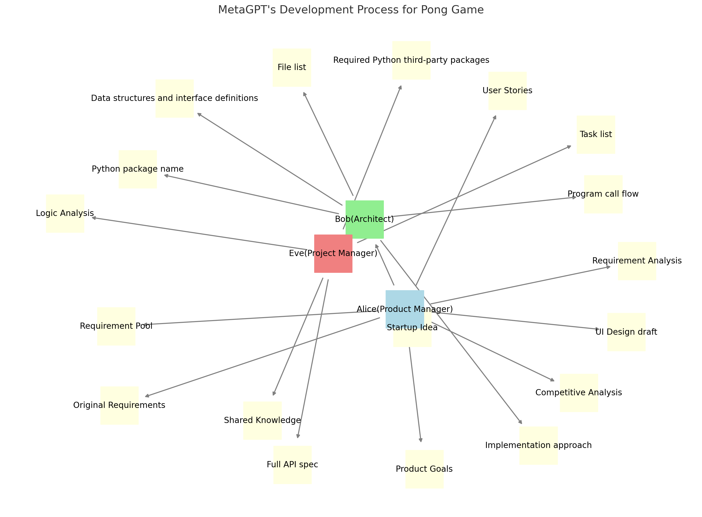

# ping-pong using metaGPT

Utilizing MetaGPT, this project implements a ping pong game with dynamic gameplay elements, leveraging natural language understanding for interactive experiences.

## the idea
In the collaborative process, our project manager oversees task delegation, the architect designs the game mechanics, and the product manager coordinates feature integration. Together, they ensure prompt alignment with user expectations and efficient project execution. Key aspects include:

- **Project Management**: Delegation and scheduling tasks.
- **Architecture Design**: Crafting game mechanics for seamless interaction.
- **Product Coordination**: Integrating features to align with user needs.

